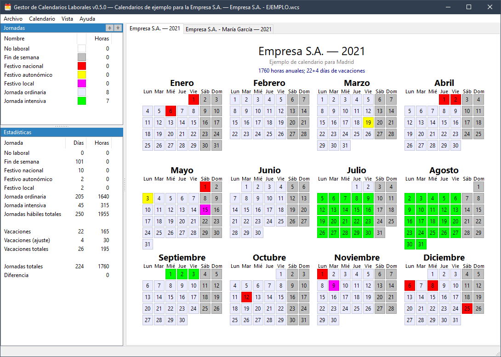

# Gestor de Calendarios Laborales

> **NOTA**: Esta es una versión preliminar de esta página. Todavía no se encuentran
> disponibles ninguna versión ni la página de ayuda.

## Introducción

El Gestor de Calendarios Laborales es una aplicación destinada al cálculo de
horas de calendarios laborales diseñada tanto para la negociación de calendarios
laborales enre empresas y trabajadores como para los trabajadores que quieran
calcular su horario anual.

Puede obtener ayuda del funcionamiento de la aplicación en la [página de ayuda
del Gestor de Calendarios Laborales](https://diegolagoglez.github.io/wcm/).

## Versiones

Puede obtener la última versión de esta aplicación [visitando la página de
*releases*](https://github.com/diegolagoglez/wcm/releases).

## Historial del cambios

### v0.5.0-20210319

Primera versión (pre-release).

## Copyright

Copyright © 2020-2021 [Diego Lago](https://twitter.com/diegolgz)
